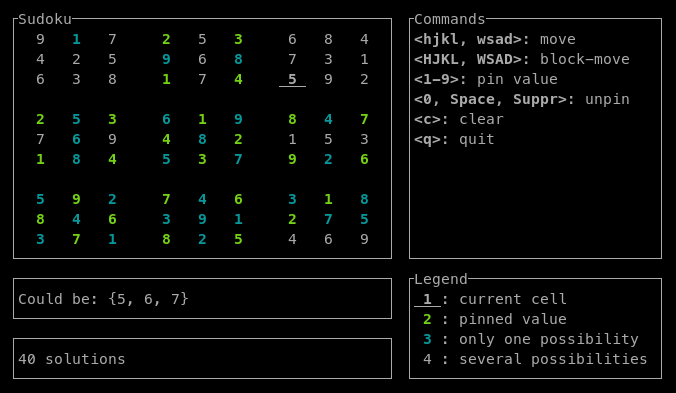

# sudoku-solver

This is a sudoku solver written in Rust.  This is separated in two crates:

- `sudoku_solver`: a library exposing a sudoku solver;
- `sudoku_tui`: a Terminal User Interface for users to define and solve puzzles
  in an interactive fashion.

